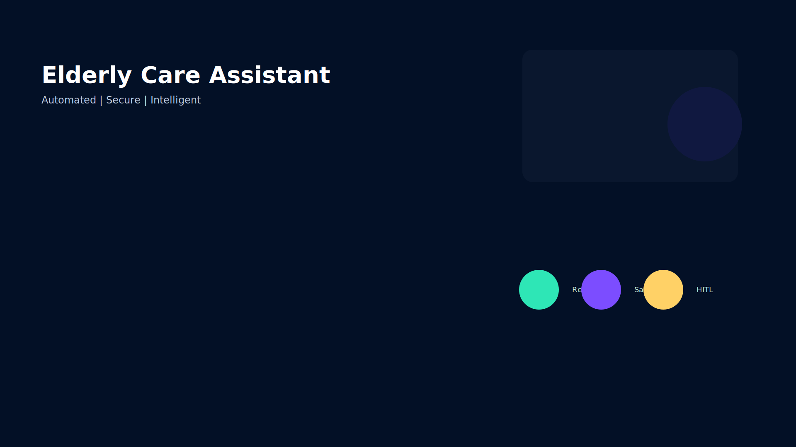

# Elderly Care Assistant

One-line description: An intelligent assistant that helps manage medication schedules, reminders, and safety checks for elderly users.

## Prerequisites
- Python 3.11+
- `uvicorn`
- Gemini API key: https://aistudio.google.com/apikey

## Quick Start
```bash
git clone <repo-url>
cd elderly-care-assistant
cp .env.example .env   # add your GOOGLE_API_KEY
make install
make playground   # opens UI at http://localhost:18081
```

## Architecture
```mermaid
flowchart LR
  User[User Interface]
  subgraph Agents
    Security[Security Checkpoint]\n(PII scrub & injection detect)
    Scheduler[SchedulerAgent]\n(Maintain schedules)
    Medication[MedicationAgent]\n(Medication logic)
    Notifier[NotificationAgent]\n(Send reminders)
  end
  MCP[MCP Server]
  Human[Human Reviewer]

  User --> Scheduler
  Scheduler --> Medication
  Medication --> Security
  Security -->|AUTO_APPROVE| Notifier
  Security -->|NEEDS_REVIEW| Human
  Medication --> MCP
  Notifier --> User
  MCP --> Agents
```

## How to run
- `make playground` → interactive UI at http://localhost:18081
- `make run` → local web server mode

## Sample Test Cases

1) Medication reminder trigger
- Input:
```json
{"user_id": "user123", "action": "check_reminders", "time": "2026-07-04T09:00:00Z"}
```
- Expected: `SchedulerAgent` finds due medications and `NotificationAgent` sends reminder via playground UI.
- Check: Playground shows reminder card and terminal logs show `NotificationAgent: reminder sent to user123`.

2) Medication interaction detected
- Input:
```json
{"user_id":"user123","action":"add_medication","medication":{"name":"DrugA","interacts_with":["DrugB"]},"current_medications":["DrugB"]}
```
- Expected: `MedicationAgent` flags interaction; `Security Checkpoint` routes to `NEEDS_REVIEW` and `Human Reviewer` receives a HITL request.
- Check: Playground shows `NEEDS_REVIEW` state and human prompt with the conflicting medications.

3) Schedule update request
- Input:
```json
{"user_id":"user123","action":"update_schedule","medication_id":"med-789","new_time":"2026-07-04T20:00:00Z"}
```
- Expected: `SchedulerAgent` updates `schedule_store.json` and confirms to user.
- Check: Terminal log shows `schedule_store.json` updated and playground shows confirmation message.

## Troubleshooting
1. Server won't start: ensure Python 3.11+ is installed and on PATH; create venv and install deps.
2. API key errors: confirm `.env` contains `GOOGLE_API_KEY` and do NOT commit `.env` to Git.
3. Stale server process after code edits: stop existing server process (Windows PowerShell):
```powershell
Get-Process -Id (Get-NetTCPConnection -LocalPort 18081, 8090 -ErrorAction SilentlyContinue).OwningProcess | Stop-Process -Force
```

## Push to GitHub

1. Create a new repo at https://github.com/new
   - Name: elderly-care-assistant
   - Visibility: Public or Private
   - Do NOT initialize with README

2. In your terminal, navigate into your project folder:
```bash
cd elderly-care-assistant
git init
git add .
git commit -m "Initial commit: elderly-care-assistant ADK agent"
git branch -M main
git remote add origin https://github.com/<sandhiyamarimuthu428-gif>/elderly-care-assistant.git
git push -u origin main
```

3. Verify `.gitignore` includes:
- .env
- .venv/
- __pycache__/
- *.pyc
- .adk/

⚠ NEVER push `.env` to GitHub. Your API key will be exposed publicly.

## Assets
- Architecture diagram: 
- Cover banner: 

Files:
- [elderly-care-assistant/assets/architecture_diagram.svg](elderly-care-assistant/assets/architecture_diagram.svg)
- [elderly-care-assistant/assets/cover_page_banner.svg](elderly-care-assistant/assets/cover_page_banner.svg)

## See also
- Submission write-up: `SUBMISSION_WRITEUP.md`
# elderly-care-assistant

Simple ReAct agent
Agent generated with `agents-cli` version `1.0.0`

## Project Structure

```
elderly-care-assistant/
├── app/         # Core agent code
│   ├── agent.py               # Main agent logic
│   ├── fast_api_app.py        # FastAPI Backend server
│   └── app_utils/             # App utilities and helpers
├── tests/                     # Unit, integration, and load tests
├── GEMINI.md                  # AI-assisted development guide
└── pyproject.toml             # Project dependencies
```

> 💡 **Tip:** Use [Antigravity CLI](https://antigravity.google/) for AI-assisted development - project context is pre-configured in `GEMINI.md`.

## Requirements

Before you begin, ensure you have:
- **uv**: Python package manager (used for all dependency management in this project) - [Install](https://docs.astral.sh/uv/getting-started/installation/) ([add packages](https://docs.astral.sh/uv/concepts/dependencies/) with `uv add <package>`)
- **agents-cli**: Agents CLI - Install with `uv tool install google-agents-cli`
- **Google Cloud SDK**: For GCP services - [Install](https://cloud.google.com/sdk/docs/install)


## Quick Start

Install `agents-cli` and its skills if not already installed:

```bash
uvx google-agents-cli setup
```

Install required packages:

```bash
agents-cli install
```

Test the agent with a local web server:

```bash
agents-cli playground
```

You can also use features from the [ADK](https://adk.dev/) CLI with `uv run adk`.

## Commands

| Command              | Description                                                                                 |
| -------------------- | ------------------------------------------------------------------------------------------- |
| `agents-cli install` | Install dependencies using uv                                                         |
| `agents-cli playground` | Launch local development environment                                                  |
| `agents-cli lint`    | Run code quality checks                                                               |
| `agents-cli eval`    | Evaluate agent behavior (generate, grade, analyze, and more — see `agents-cli eval --help`) |
| `uv run pytest tests/unit tests/integration` | Run unit and integration tests                                                        |
| `agents-cli deploy`  | Deploy agent to Agent Runtime                                                                |
| `agents-cli publish gemini-enterprise` | Register deployed agent to Gemini Enterprise                    || [A2A Inspector](https://github.com/a2aproject/a2a-inspector) | Launch A2A Protocol Inspector                                                        |

## 🛠️ Project Management

| Command | What It Does |
|---------|--------------|
| `agents-cli scaffold enhance` | Add CI/CD pipelines and Terraform infrastructure |
| `agents-cli infra cicd` | One-command setup of entire CI/CD pipeline + infrastructure |
| `agents-cli scaffold upgrade` | Auto-upgrade to latest version while preserving customizations |

---

## Development

Edit your agent logic in `app/agent.py` and test with `agents-cli playground` - it auto-reloads on save.

## Deployment

```bash
gcloud config set project <your-project-id>
agents-cli deploy
```

To add CI/CD and Terraform, run `agents-cli scaffold enhance`.
To set up your production infrastructure, run `agents-cli infra cicd`.

## Observability

Built-in telemetry exports to Cloud Trace, BigQuery, and Cloud Logging.

## A2A Inspector

This agent supports the [A2A Protocol](https://a2a-protocol.org/). Use the [A2A Inspector](https://github.com/a2aproject/a2a-inspector) to test interoperability.
See the [A2A Inspector docs](https://github.com/a2aproject/a2a-inspector) for details.
