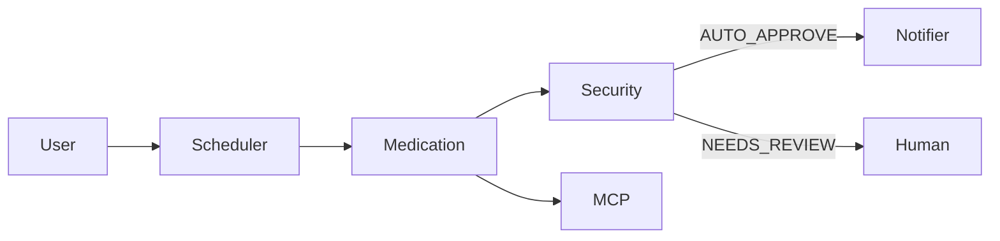

# Submission Writeup — Elderly Care Assistant

## Problem Statement
Elderly users and their caregivers need an automated, reliable assistant to manage medication schedules, send timely reminders, and detect potentially harmful medication interactions. Manual tracking is error-prone and can lead to missed doses or dangerous interactions.

## Solution Architecture
The solution composes modular agents with an MCP server and a security checkpoint that enforces safety checks and routes requests to human reviewers when necessary.

## Concepts Used
- ADK Workflow: scaffolded in this repo and implemented in `app/agent.py` and `app/mcp_server.py` ([app/agent.py](elderly-care-assistant/app/agent.py), [app/mcp_server.py](elderly-care-assistant/app/mcp_server.py)).
- `LlmAgent` and `AgentTool` patterns are present in the agent implementations and referenced by the MCP calls.
- Security Checkpoint: implemented as a gate between business logic and notification delivery (`app/app_utils/services.py`).
- Agents CLI: project scaffolding and run targets (see `pyproject.toml` and `Makefile`).

## Security Design
- API key protection: `GOOGLE_API_KEY` stored only in `.env` and excluded from Git (`.gitignore`).
- Input validation and PII scrubbing: Security Checkpoint examines incoming messages for injections and PII before forwarding to downstream agents (`app/config.py`, `app/app_utils/telemetry.py`).
- Human-in-the-loop (HITL): any flagged decision (route `NEEDS_REVIEW`) pauses execution and creates a human review task.

## MCP Server Design
- Purpose: centralize tools and external integrations used by agents (e.g., storage, evaluation, external APIs). See [app/mcp_server.py](elderly-care-assistant/app/mcp_server.py).
- Tools: storage access to `medication_store.json` and `schedule_store.json`, logging, and telemetry.

## HITL Flow
1. Agent detects a medication interaction or ambiguous instruction.
2. Security Checkpoint flags the request and emits a `RequestInput` to the Human Reviewer.
3. Human Reviewer inspects the payload and either approves or modifies the decision.
4. On approval, the MCP server resumes the agent workflow.

## Demo Walkthrough
Use the three sample test cases from `README.md` to exercise the main flows:
- Reminder delivery (AUTO_APPROVE path)
- Interaction detection and NEEDS_REVIEW (HITL)
- Schedule update and persistence

## Impact / Value Statement
This assistant reduces missed doses and prevents harmful interactions by automating reminders and adding safety checks with an explicit human review path — improving patient safety and caregiver peace of mind.
